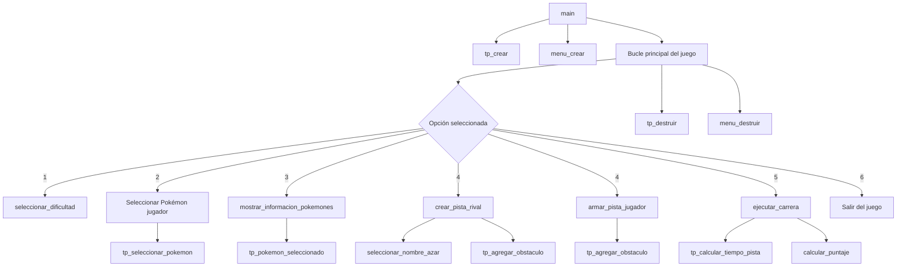

# TP: Carrera de obstáculos

## Repositorio de (Juan Bautista Oviedo Runzio) - (110164) - (jbauti9@gmail.com/joviedo@fi.uba.ar)

- Para correr todo:

```bash
make
```

- Para ejecutar el juego:

```bash
./juego ejemplo/pokemones.txt
```

- Para compilar:

```bash
gcc -std=c99 -Wall -Wconversion -Wtype-limits -pedantic -Werror -O2 -g src/*.c pruebas_alumno.c -o pruebas_alumno
```

- Para ejecutar los Tests:

```bash
./pruebas_alumno
```

- Para ejecutar con valgrind:

```bash
valgrind --leak-check=full --track-origins=yes --show-reachable=yes --error-exitcode=2 --show-leak-kinds=all --trace-children=yes ./pruebas_alumno
```

---

## Introducción

El objetivo del presente trabajo práctico es poner en práctica el uso de los distintos Tipos de Dato Abstractos (TDA) vistos a lo largo de la cursada y sus primitivas. Para gestionar las conexiones entre los distintos pokemones, la estructura que se eligio es la de un Árbol Binario de Búsqueda (ABB), que cuenta con un puntero a la raíz y un contador entero que indica el número de elementos (pokemones) que contiene.

Para asegurar la correcta implementación del TDA TP, se llevaron a cabo pruebas unitarias que cubren una amplia gama de casos, incluidos algunos casos límite. Cada prueba garantiza que el caso correspondiente esté cubierto y que el sistema no falle en el futuro. Además, se aplicó la metodología TDD, intentando primero escribir las pruebas y luego implementar la solución mínima.

### Estructuras

El juego se basa en varias estructuras clave:

`struct` `tp`: Representa el estado general del juego, incluyendo el ABB de Pokémon y la información de los jugadores.
`struct` `pokemon_info`: Contiene la información de cada Pokémon, como nombre y atributos.
`player_t`: Representa a un jugador, incluyendo su Pokémon seleccionado y la pista de obstáculos.

## Funcionamiento

- _Creación del Árbol_
  El juego comienza cargando la información de los Pokémon desde un archivo de texto. Esta información se almacena en un ABB para permitir búsquedas eficientes. La función `tp_crear` en `tp.c` se encarga de esta inicialización:

```c
TP *tp_crear(const char *nombre_archivo)
{
    FILE *fp = fopen(nombre_archivo, "r");
        if (!fp)
            return NULL;
        TP *juego = (TP *)calloc(1, sizeof(TP));
        if (!juego) {
            fclose(fp);
            return NULL;
        }
        juego->jugador_1 = jugador_crear(JUGADOR_1);
        if (!juego->jugador_1) {
            free(juego);
            fclose(fp);
            return NULL;
        }
        juego->jugador_2 = jugador_crear(JUGADOR_2);
        if (!juego->jugador_2) {
            jugador_destructor(juego->jugador_1);
            free(juego);
            fclose(fp);
            return NULL;
        }
        juego->abb_pokemones = abb_crear(cmp_pokemones);

        //Validaciones

        fclose(fp);
        return juego;
}
```

- _Selección de Pokémon_
  Los jugadores pueden seleccionar su Pokémon de una lista disponible. La función `tp_seleccionar_pokemon` maneja esta selección:

  ```c
  bool tp_seleccionar_pokemon(TP *tp, enum TP_JUGADOR jugador, const char *nombre)
  {
  	if (!tp || !nombre || jugador > JUGADOR_2)
  		return false;
  	const struct pokemon_info *pokemonn = tp_buscar_pokemon(tp, nombre);

  	if (jugador == JUGADOR_2)
  		return jugador_agregar_pokemon(tp->jugador_2, tp->jugador_1,
  					       pokemonn);
  	return jugador_agregar_pokemon(tp->jugador_1, tp->jugador_2, pokemonn);
  }
  ```

- _Creación de pistas de obstáculos_
  Los jugadores pueden crear pistas de obstáculos (Fuerza, Destreza, Inteligencia). La función `tp_agregar_obstaculo` permite añadir obstáculos a la pista:

```c
 unsigned tp_agregar_obstaculo(TP *tp, enum TP_JUGADOR jugador,
			      enum TP_OBSTACULO obstaculo, unsigned posicion)
{
	if (jugador > JUGADOR_2 || obstaculo > OBSTACULO_INTELIGENCIA || !tp)
		return 0;
	player_t *jugador_ = tp->jugador_1;
	if (jugador == JUGADOR_2)
		jugador_ = tp->jugador_2;
	return jugador_insertar_pista(jugador_, obstaculo, posicion);
}
```

- _Cálculo del tiempo de carrera_
  El tiempo que tarda un Pokémon en completar la pista se calcula teniendo en cuenta sus atributos y los tipos de obstáculos. La función `jugador_tiempo_pista` en `jugador.c `realiza este cálculo:

```c
unsigned jugador_tiempo_pista(player_t *jugador)
{
	if (!jugador || !jugador->pokemon)
		return 0;

	unsigned tiempo_total = 0;
	int obstaculos_consecutivos[3] = { 0 };

	for (unsigned i = 0; i < jugador->tamanio_pista; i++) {
		int atributo = 0;
		int *consecutivos = NULL;

		if (jugador->pista[i] == OBSTACULO_FUERZA) {
			atributo = jugador->pokemon->fuerza;
			consecutivos = &obstaculos_consecutivos[0];
		} else if (jugador->pista[i] == OBSTACULO_DESTREZA) {
			atributo = jugador->pokemon->destreza;
			consecutivos = &obstaculos_consecutivos[1];
		} else if (jugador->pista[i] == OBSTACULO_INTELIGENCIA) {
			atributo = jugador->pokemon->inteligencia;
			consecutivos = &obstaculos_consecutivos[2];
		} else {
			continue;
		}

		int tiempo = 10 - *consecutivos - atributo;
		if (tiempo < 0)
			tiempo = 0;
		tiempo_total += (unsigned)tiempo;

		(*consecutivos)++;
		obstaculos_consecutivos[0] =
			(jugador->pista[i] == OBSTACULO_FUERZA) ?
				obstaculos_consecutivos[0] :
				0;
		obstaculos_consecutivos[1] =
			(jugador->pista[i] == OBSTACULO_DESTREZA) ?
				obstaculos_consecutivos[1] :
				0;
		obstaculos_consecutivos[2] =
			(jugador->pista[i] == OBSTACULO_INTELIGENCIA) ?
				obstaculos_consecutivos[2] :
				0;
	}

	return tiempo_total;
}
```

En esta función se recorre la pista del jugador, obstáculo por obstáculo, y calcula el tiempo necesario para superar cada uno. Los aspectos a destacar son:

- Correspondencia obstáculo-atributo: Cada tipo de obstáculo (FUERZA, DESTREZA, INTELIGENCIA) se corresponde con un atributo del Pokémon.
- Cálculo del tiempo por obstáculo: El tiempo base para superar un obstáculo es 10, que se reduce por el valor del atributo correspondiente del Pokémon y el número de obstáculos consecutivos del mismo tipo.
- Obstáculos consecutivos: Se mantiene un contador para cada tipo de obstáculo. Obstáculos consecutivos del mismo tipo reducen progresivamente el tiempo necesario para superarlos.
- Tiempo mínimo: El tiempo para superar un obstáculo nunca puede ser negativo, por lo que se establece un mínimo de 0.
- Acumulación del tiempo total: Se suma el tiempo de cada obstáculo para obtener el tiempo total de la carrera.

Ademas esta implementación refleja de manera realista cómo diferentes Pokémon pueden tener ventajas en ciertos tipos de obstáculos y cómo la repetición de obstáculos similares puede mejorar el rendimiento.

- _Ejecución de la carrera_
  La carrera se simula calculando los tiempos de ambos jugadores y comparándolos. La función `ejecutar_carrera` en `juego.c` maneja este proceso:

```c
bool ejecutar_carrera(TP *tp, Dificultad dif)
{
	int intentos = 0;

	do {
		unsigned tiempo_jugador =
			tp_calcular_tiempo_pista(tp, JUGADOR_1);
		unsigned tiempo_rival = tp_calcular_tiempo_pista(tp, JUGADOR_2);
		printf("Tiempo del jugador: %u\n", tiempo_jugador);
		printf("Tiempo del rival: %u\n", tiempo_rival);

		double puntaje = calcular_puntaje(tiempo_jugador, tiempo_rival);
		printf("Puntaje: %.2f\n", puntaje);

		if (tiempo_jugador == tiempo_rival) {
			printf("¡Empate perfecto!\n");
		} else if (puntaje > 90) {
			printf("¡Excelente resultado!\n");
		} else if (puntaje > 70) {
			printf("Buen resultado\n");
		} else {
			printf("Puedes mejorar\n");
		}

		intentos++;

		if (intentos < dif.intentos_maximos) {
			char respuesta;
			printf("¿Desea intentar de nuevo? (S/N): ");
			scanf(" %c", &respuesta);
			while (getchar() != '\n')
				;
			if (respuesta != 'N' && respuesta != 'n') {
				printf("Volviendo al menú principal\n");
				return true;
			}
		} else {
			printf("Has alcanzado el máximo número de intentos\n");
			printf("A continuacion volveras al menú principal...\n");
			return true;
		}
	} while (intentos < dif.intentos_maximos);

	return true;
}
```

---

## El juego

El archivo `juego.c` contiene la lógica principal del juego de carrera de obstáculos Pokémon. El resumen de sus principales componentes y funciones:

- Función `main()`:

  - Punto de entrada del programa
  - Inicializa el juego llamando a `tp_crear()`
  - Crea el menú del juego
  - Inicia el bucle principal del juego

- Bucle principal del juego:

  - Muestra el menú y procesa las opciones del usuario
  - Llama a diferentes funciones según la opción seleccionada

- Funciones principales:

  - _seleccionar_dificultad():_ Permite al usuario elegir el nivel de dificultad
  - _crear_pista_rival():_ Crea la pista para el rival (computadora)
  - _armar_pista_jugador():_ Permite al jugador crear su propia pista
  - _ejecutar_carrera():_ Simula la carrera entre el jugador y el rival

- Funciones auxiliares:

  - _mostrar_informacion_pokemones():_ Muestra información de los Pokémon seleccionados
  - _seleccionar_nombre_azar():_ Elige un Pokémon aleatorio para el rival
  - _pokemon_existe():_ Verifica si un Pokémon está en la lista de disponibles
  - _calcular_puntaje():_ Calcula el puntaje de la carrera

A continuacion, armo un gráfico que ilustra el flujo de la ejecución y las llamadas a funciones:



---

## Respuestas a las preguntas teóricas

1. Estructura interna del TDA TP
   La estructura interna del TDA TP se define de la siguiente manera:

```c
struct tp {
    abb_t *abb_pokemones;
    player_t *jugador_1;
    player_t *jugador_2;
    bool iniciado;
};
```

Esta estructura se eligió por las siguientes razones:

a) **abb_pokemones**: Un árbol binario de búsqueda (ABB) que almacena todos los Pokémon disponibles.
Se eligió un ABB porque:

- Permite búsquedas eficientes (O(log n) en promedio) de Pokémon por nombre.
- Mantiene los Pokémon ordenados, lo que facilita operaciones como listar Pokémon en orden alfabético.
- Es eficiente para inserciones y eliminaciones si fueran necesarias.

b) **jugador_1** y **jugador_2**: Son punteros a estructuras `player_t` que representan a los dos jugadores.
Esto permite:

- Encapsular toda la información relevante de cada jugador (Pokémon seleccionado, pista de obstáculos, etc.) en una única estructura.
- Facilitar la expansión a más jugadores si fuera necesario en el futuro.

c) **iniciado**: Es un booleano que indica si el juego ha comenzado. Esto puede ser útil para controlar el flujo del juego y prevenir acciones fuera de secuencia.

Esta estructura proporciona una clara separación de responsabilidades y facilita la gestión del estado del juego.

2. Justificación de la complejidad de las operaciones implementadas:

- _Inserción de Pokémon (`tp_crear`):_ O(n log n), donde n es el número de Pokémon. Cada inserción en el ABB es O(log n), y se realiza n veces.
- _Búsqueda de Pokémon (`tp_buscar_pokemon`):_ O(log n) en promedio, debido a la estructura del ABB.
- _Selección de Pokémon (`tp_seleccionar_pokemon`):_ O(log n), ya que implica una búsqueda en el ABB.
- _Agregar obstáculo (`tp_agregar_obstaculo`):_ O(1) amortizado, ya que utiliza un vector dinámico para la pista.
- _Cálculo del tiempo de pista (`jugador_tiempo_pista`):_ O(m), donde m es la longitud de la pista, ya que recorre cada obstáculo una vez.
- _Recorrido del ABB (`tp_nombres_disponibles`):_ O(n), donde n es el número de Pokémon, ya que debe visitar cada nodo una vez.
- _Ejecución de carrera (`ejecutar_carrera`):_ O(m), donde m es la longitud de la pista más larga, ya que implica calcular el tiempo para ambos jugadores.

Estas complejidades se justifican por el uso eficiente de estructuras de datos como el ABB para los Pokémon y vectores dinámicos para las pistas de obstáculos. La mayoría de las operaciones críticas (como la búsqueda y selección de Pokémon) se benefician de la estructura del ABB, manteniendo una complejidad logarítmica en el número de Pokémon.
