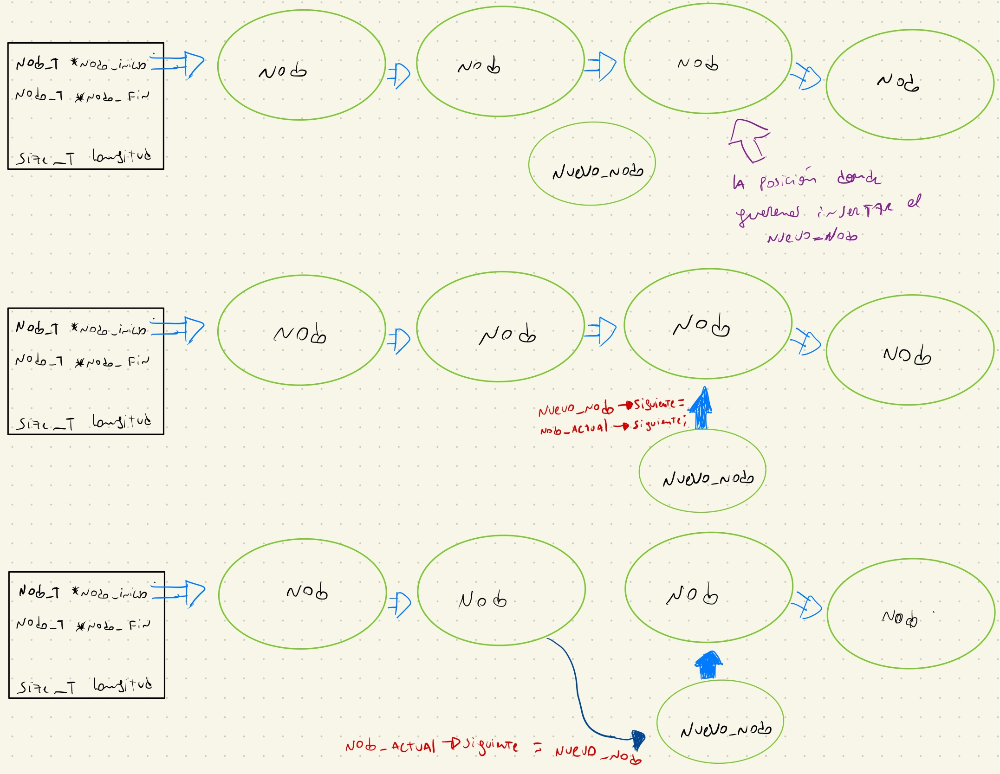
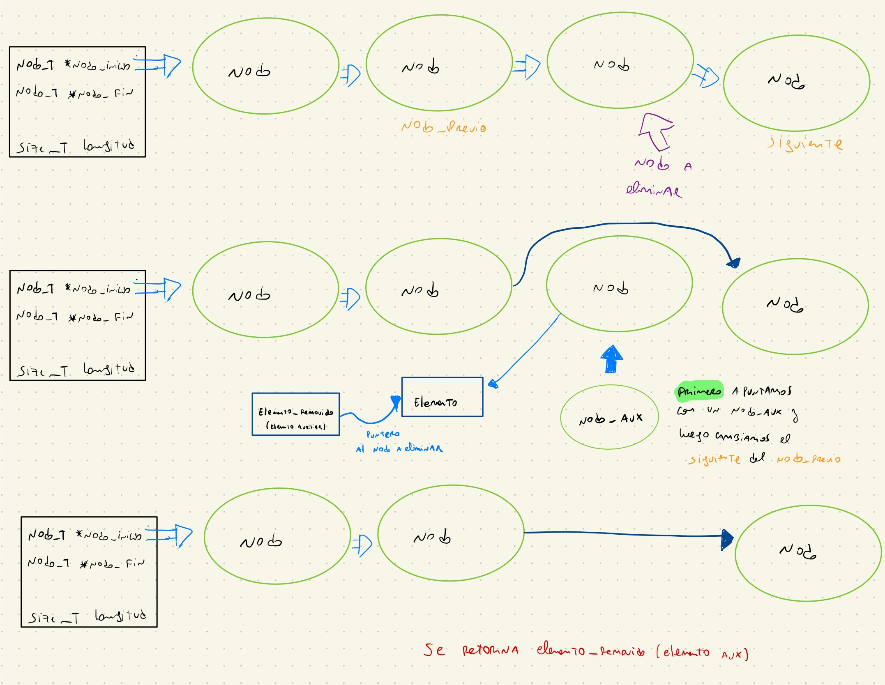
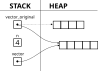
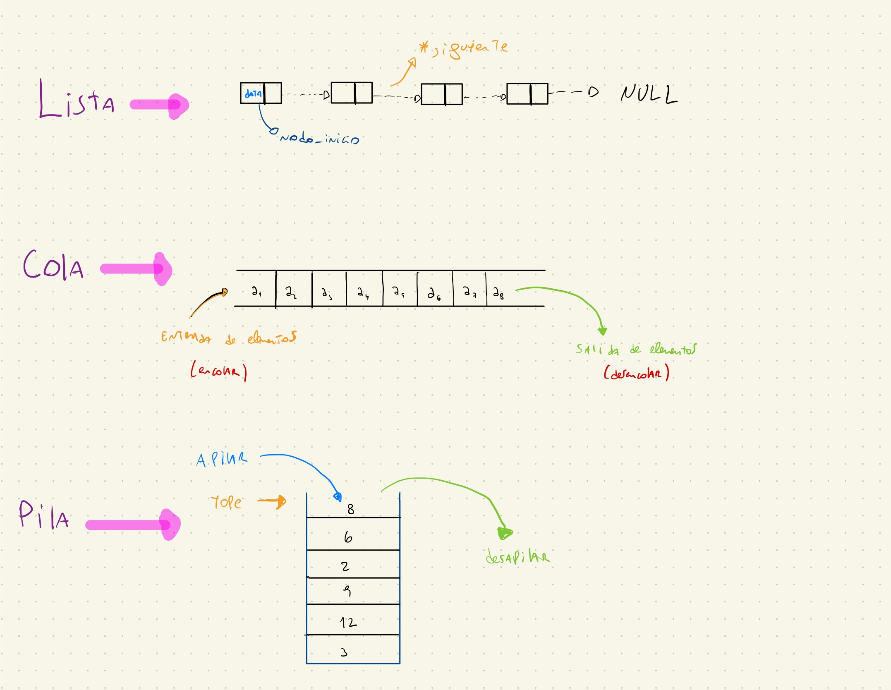

<div align="right">

</div>

# TDA LISTA

## Alumno: (Juan Bautista Oviedo Runzio) - (110164) - (jbauti9@gmail.com/joviedo@fi.uba.ar)

- Para correr todo:

```bash
make
```

- Para compilar:

```bash
gcc -std=c99 -Wall -Wconversion -Wtype-limits -pedantic -Werror -O2 -g src/*.c pruebas_alumno.c -o pruebas_alumno
```

- Para ejecutar:

```bash
./pruebas_alumno
```

- Para ejecutar con valgrind:

```bash
valgrind --leak-check=full --track-origins=yes --show-reachable=yes --error-exitcode=2 --show-leak-kinds=all --trace-children=yes ./pruebas_alumno
```

---

## Introducción

El objetivo central de este proyecto es aplicar el concepto de Tipo de Dato Abstracto (TDA) lista, utilizando nodos simplemente enlazados. Estos nodos permiten administrar bloques de memoria dinámica de forma no contigua. La lista está estructurada con un puntero que señala al primer nodo y otro puntero que señala al último nodo. Cada nodo contiene un puntero al siguiente nodo y al elemento que almacena.

Con estas estructuras definidas para la lista, se procedió a implementar tanto una pila como una cola, realizando algunos ajustes necesarios. Para la cola, se sigue el principio de "primero en entrar, primero en salir(FIFO)", utilizando la función de inserción de la lista para encolar y la función de eliminación de posición con posición 0 para desencolar. Por otro lado, para la pila, siguiendo el principio de "último en entrar, primero en salir(LIFO)", se utiliza la función de inserción de la lista para apilar y la función de eliminación para desapilar.

Para asegurar que los TDAs se implementaran correctamente, se llevaron a cabo pruebas unitarias, que abarcan una amplia gama de casos. Cada prueba valida un caso específico y garantiza que el código funcione correctamente en el futuro. Se adoptó una metodología de Desarrollo Guiado por Pruebas (TDD), donde primero se escriben las pruebas y luego se implementa la solución mínima para pasar esas pruebas.

## Funcionamiento

Para desarrollar el TDA lista con nodos simplemente enlazados, la estructura de la lista debe contar con punteros que señalen al primer y al último nodo, además de un contador para llevar la cuenta de la cantidad total de elementos en la lista.

Cuando se inserta un elemento en la última posición, el proceso sigue estos pasos con una complejidad constante O(1), ya que independientemente del tamaño de la lista, siempre se realizan las mismas operaciones:

    1. Se reserva espacio en memoria para un nuevo nodo, se le asigna el elemento y se establece su siguiente como NULL.
    2. El último nodo existente en la lista pasa a tener como siguiente al nuevo nodo.
    3. La lista pasa a tener como nodo final el nuevo nodo, se le suma uno a la longitud y se retorna el puntero a la lista.

Si se desea insertar en una posición específica n, el proceso sigue estos pasos con una complejidad lineal O(n), donde n representa la posición deseada:

    1. Se reserva espacio en memoria para el nuevo nodo y se le asigna el elemento.
    2. Se itera hasta llegar al nodo que precede a la posición n-1.
    3. Se conecta el nuevo nodo con el nodo siguiente al nodo actual y se establece el nodo actual como el siguiente del nuevo nodo.
    4. Se incrementa la longitud.

#### Diagrama de insertar

<div align="center">

</div>

Para eliminar un elemento de la última posición, el proceso tiene una complejidad lineal O(n), siendo n la cantidad total de elementos en la lista, ya que implica buscar el nodo que precede al último nodo:

    1. Se itera hasta encontrar el nodo que tenga como siguiente el puntero al último nodo.
    2. Se crea un puntero auxiliar que apunta al siguiente del nodo actual (último nodo) y otro puntero auxiliar que almacena el elemento del nodo auxiliar.
    3. Se actualiza el puntero al último nodo para que apunte al nodo actual (que ahora será el nuevo último nodo) y se libera el nodo auxiliar.
    4. Se decrementa en uno la longitud y se retorna el elemento almacenado en el nodo auxiliar.

Para eliminar un elemento en una posición específica n, el proceso sigue estos pasos con una complejidad lineal O(n), ya que implica iterar hasta la posición n-1:

    1. Se itera hasta llegar al nodo que precede a la posición n-1.
    2. Se crea un puntero auxiliar que apunta al siguiente del nodo actual (nodo a eliminar).
    3. Se conecta el nodo actual con el nodo siguiente al nodo auxiliar.
    4. Se almacena el elemento del nodo auxiliar en un puntero void auxiliar.
    5. Se libera el nodo auxiliar, se decrementa en uno la longitud y se retorna el elemento almacenado en el puntero auxiliar.

#### Diagrama de eliminar

<div align="center">

</div>

Para destruir todo, la funcion itera todos los nodos de la lista, aplicando una operación al elemento (si existe) y luego liberando la memoria asignada a cada nodo. Una vez completado este proceso, se libera la memoria reservada para la lista en sí.

#### Diagrama de destruir todo

<div align="center">

</div>

### Para los TDA Pila y Cola

Para estos escenarios específicos de la lista, se aprovecharon las estructuras y funciones previamente implementadas, tal como se detalló en la parte de Introducción. Para ello se casteo el puntero a la lista como si fuese un puntero a pila o cola respectivamente.

En general, en las funciones donde se tiene que retornar un puntero a pila o cola se casteaba a la hora de retornar el puntero a lista a (pila_t *) o (cola_t *) dependiendo del caso. Por otro lado, a la hora de usar las funciones que reciben un puntero a lista como parámetro, se casteaba el puntero (lista_t *) de modo de que la funcion tomara el puntero que se estaba pasando como si fuese un puntero a lista.

Para llevar a cabo las operaciones con pila y cola, como se mencionó anteriormente, en el caso de la cola, se tiene como “contrato” que el primer elemento en entrar es el primero en salir, entonces para la implementación de encolar se utilizó la función de lista insertar y para desencolar se utilizó la función quitar de posición, usando siempre posición = 0 (primer elemento). En el caso de la pila se tiene como “contrato” que el primero en entrar es el último en salir, entonces para apilar se usó lista insertar y para desapilar se usó lista quitar.

### Por ejemplo:

El programa funciona abriendo el archivo pasado como parámetro y leyendolo línea por línea. Por cada línea crea un registro e intenta agregarlo al vector. La función de lectura intenta leer todo el archivo o hasta encontrar el primer error. Devuelve un vector con todos los registros creados.

<div align="center">

</div>

En el archivo `sarasa.c` la función `funcion1` utiliza `realloc` para agrandar la zona de memoria utilizada para conquistar el mundo. El resultado de `realloc` lo guardo en una variable auxiliar para no perder el puntero original en caso de error:

```c
int *vector = realloc(vector_original, (n+1)*sizeof(int));

if(vector == NULL)
    return -1;
vector_original = vector;
```

<div align="center">

</div>

---

## Respuestas a las preguntas teóricas

### TDA 

<div align="center">

</div>

Insertar/obtener/eliminar al inicio:
    Lista simplemente enlazada: Insertar y eliminar al inicio tienen una complejidad de O(1), ya que solo se modifican los punteros del primer elemento.
    Lista doblemente enlazada: También tienen una complejidad de O(1) para insertar y eliminar al inicio, ya que se pueden acceder tanto al primer elemento como al anterior de manera directa.
    Vector dinámico: Insertar al inicio tiene una complejidad de O(n) en promedio, ya que se deben desplazar todos los elementos hacia la derecha para hacer espacio para el nuevo elemento. Obtener y eliminar al inicio tienen una complejidad de O(1).
Insertar/obtener/eliminar al final:
    Lista simplemente enlazada: Insertar al final tiene una complejidad de O(n), ya que se debe iterar sobre todos los elementos para llegar al último. Obtener y eliminar al final también tienen una complejidad de O(n) en este caso.
    Lista doblemente enlazada: Insertar, obtener y eliminar al final tienen una complejidad de O(1), ya que se puede acceder directamente al último elemento.
    Vector dinámico: Insertar al final tiene una complejidad amortizada de O(1), ya que se puede agregar al final del vector sin necesidad de desplazar elementos. Obtener y eliminar al final tienen una complejidad de O(1).
Insertar/obtener/eliminar al medio:
    Lista simplemente enlazada: Insertar, obtener y eliminar al medio tienen una complejidad de O(n), ya que se debe iterar sobre la lista para llegar a la posición deseada.
    Lista doblemente enlazada: Insertar, obtener y eliminar al medio tienen una complejidad de O(n/2), ya que se puede acceder al medio de la lista más rápidamente al tener punteros tanto hacia adelante como hacia atrás.
    Vector dinámico: Insertar, obtener y eliminar al medio tienen una complejidad de O(n), ya que se deben desplazar los elementos que están después de la posición deseada.
    
        


