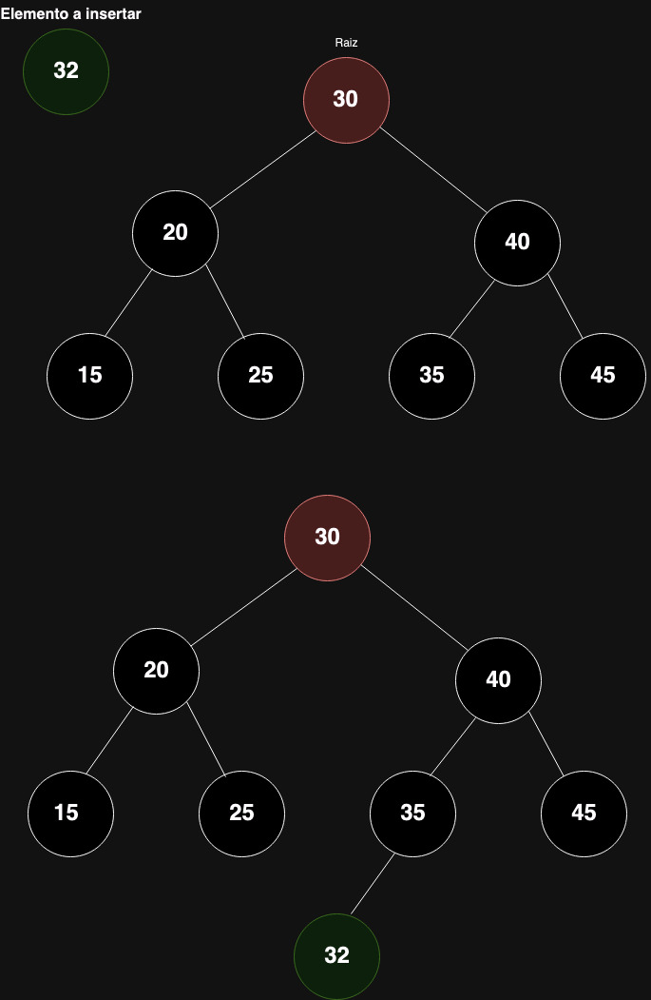
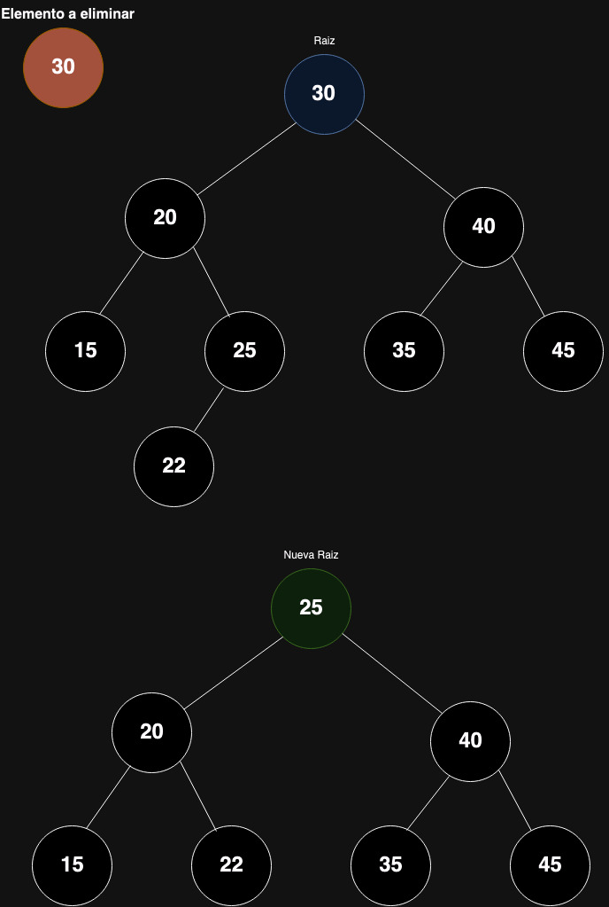
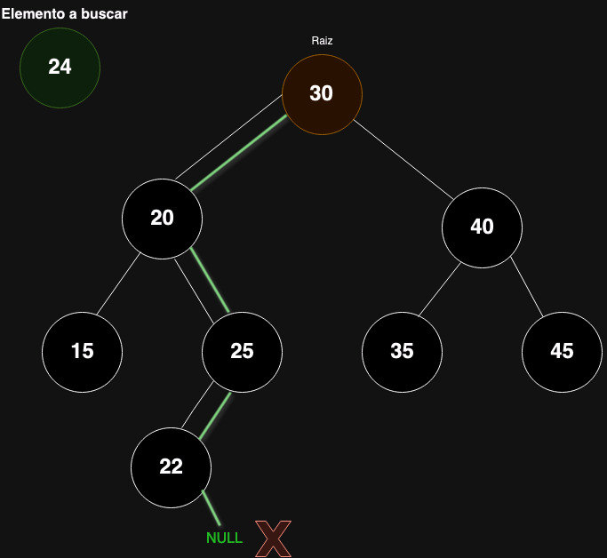
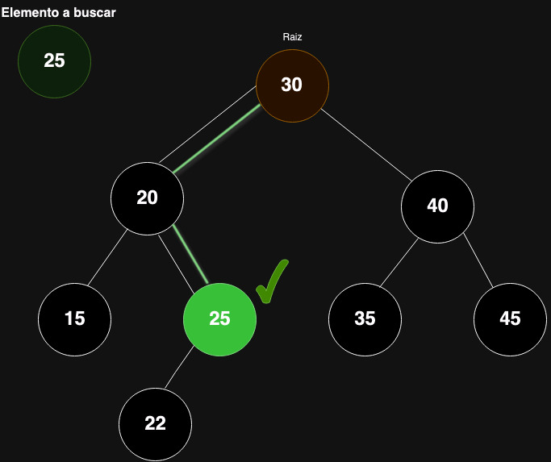

# TDA ABB

## Repositorio de (Juan Bautista Oviedo Runzio) - (110164) - (jbauti9@gmail.com/joviedo@fi.uba.ar)

- Para correr todo:

```bash
make
```

- Para compilar:

```bash
gcc -std=c99 -Wall -Wconversion -Wtype-limits -pedantic -Werror -O2 -g src/*.c pruebas_alumno.c -o pruebas_alumno
```

- Para ejecutar:

```bash
./pruebas_alumno
```

- Para ejecutar con valgrind:

```bash
valgrind --leak-check=full --track-origins=yes --show-reachable=yes --error-exitcode=2 --show-leak-kinds=all --trace-children=yes ./pruebas_alumno
```

---

## Introducción

El objetivo del presente trabajo práctico es poner en práctica el Tipo de Dato Abstracto ABB (Árbol Binario de Búsqueda) y sus primitivas. Para gestionar las conexiones entre los distintos nodos, la estructura del árbol cuenta con un puntero a la raíz y un contador entero que indica el número de elementos o nodos que contiene. Cada nodo está representado por una estructura que incluye punteros a sus hijos y al elemento que almacena.

El árbol se puede recorrer de tres maneras: INORDEN, PREORDEN y POSTORDEN.

- En el recorrido INORDEN, se visita primero el hijo izquierdo, luego el nodo actual y finalmente el hijo derecho.
- En el recorrido PREORDEN, se visita primero el nodo actual, luego el hijo izquierdo y por último el hijo derecho.
- En cuanto al recorrido POSTORDEN, se visitan primero los hijos izquierdo y derecho, y luego el nodo actual.

En la implementación del ABB, se han considerado ciertos aspectos. Por ejemplo, al eliminar un nodo, se reemplaza con su predecesor inorden. En cuanto a la inserción, si el elemento a insertar es igual al elemento actual, se considera como menor.

Para asegurar la correcta implementación del TDA, se llevaron a cabo pruebas unitarias que cubren una amplia gama de casos, incluidos los casos límite. Cada prueba garantiza que el caso correspondiente esté cubierto y que el sistema no falle en el futuro. Además, se aplicó la metodología TDD, intentando primero escribir las pruebas y luego implementar la solución mínima.

---

## Teoría

### Árbol

Un árbol representa una colección de nodos, donde uno de ellos destaca como el nodo raíz. Este nodo raíz puede o no tener nodos hijos. En caso de tenerlos, cada uno de estos nodos hijos puede considerarse como la raíz de un subárbol independiente. Esta estructura facilita la organización y gestión de grandes conjuntos de datos, ya que el tiempo de búsqueda suele ser de complejidad O(log n).

### Árbol Binario

Los árboles binarios son estructuras en las que cada nodo puede tener 0, 1 o 2 hijos. Estos hijos se denominan comúnmente "izquierdo" y "derecho", lo que proporciona una clara distinción de los subárboles. Sin embargo, este tipo de estructura no ofrece una forma clara de comparar nodos y determinar el camino a seguir durante las operaciones de búsqueda.

### Árbol Binario de Búsqueda

El concepto de árbol binario de búsqueda extiende la idea del árbol binario al introducir la noción de comparación entre los nodos y su padre. En un árbol binario de búsqueda, se establece que el hijo izquierdo es menor que su padre, mientras que el hijo derecho es mayor. Esta relación de ordenamiento permite una búsqueda más eficiente, similar a la búsqueda binaria, lo que resulta en una complejidad de búsqueda logarítmica en el árbol.

---

## Funcionamiento

_Inserción_: Cuando se inserta un nodo en un árbol binario de búsqueda, se inicia comparando el elemento que se desea insertar con el elemento del nodo actual. Comenzando desde el nodo raíz, se pregunta: ¿es menor? En caso afirmativo, se sigue el camino hacia el subárbol izquierdo; ¿es mayor? Entonces se avanza hacia el subárbol derecho. Cuando no hay más nodos disponibles en la dirección seleccionada, se llega al "final" de la rama y es el momento de realizar la inserción. Por ejemplo, al insertar el número 32.

```c
nodo_abb_t *inserto_elemento_y_comparo(abb_t *arbol, nodo_abb_t *nodo_actual, void *elemento)
{
	if (nodo_actual == 0) {
		nodo_abb_t *nuevo_nodo = malloc(sizeof(nodo_abb_t));
		if (nuevo_nodo == 0)
			return NULL;
		nuevo_nodo->elemento = elemento;
		nuevo_nodo->izquierda = NULL;
		nuevo_nodo->derecha = NULL;
		arbol->tamanio++;
		return nuevo_nodo;
	}

	int comparacion = arbol->comparador(elemento, nodo_actual->elemento);
	if (comparacion > 0)
		nodo_actual->derecha = inserto_elemento_y_comparo(arbol, nodo_actual->derecha, elemento);

	if (comparacion <=0)
		nodo_actual->izquierda = inserto_elemento_y_comparo(arbol, nodo_actual->izquierda, elemento);

	return nodo_actual;
}
```

La función `abb_insertar` se encarga de añadir nuevos elementos al árbol binario de búsqueda. Utiliza una función auxiliar recursiva llamada `inserto_elemento_y_comparo`. En cada llamada recursiva, se verifica si el nodo actual es nulo. En caso afirmativo, se reserva memoria para el nuevo nodo, se establecen los punteros de los hijos como nulos y se asigna el puntero al nuevo elemento. Si el nodo actual no es nulo, se compara el elemento a insertar con el elemento del nodo actual para determinar hacia qué subárbol continuar. Luego, se llama recursivamente a la misma función, modificando el nodo actual por el nodo izquierdo o derecho, según corresponda. Es importante destacar que el valor devuelto por esta función debe asignarse al nodo que se pasa como parámetro. Por ejemplo: `hijo_izquierdo = función(hijo_izquierdo...)`, para así guardar los cambios realizados en los hijos y continuar conectando los nodos.

<div align="center">

</div>

#

_Eliminación_: Como se mencionó previamente, al eliminar un nodo se adoptó la convención de reemplazarlo por su menor sucesor inorden. Durante este proceso, se lleva a cabo una comparación similar a la realizada en la inserción. Sin embargo, en este caso, al encontrar el elemento a eliminar, se detiene la búsqueda. Luego, se verifica si el nodo a eliminar tiene hijos. En caso de no tenerlos (es decir, ser nodos hoja), simplemente se libera la memoria del nodo.

Si el nodo a eliminar tiene un solo hijo, se guarda una referencia a ese hijo en un auxiliar. Luego, se libera la memoria del nodo a eliminar y se retorna el auxiliar, el cual se conecta al padre del nodo eliminado.

Cuando el nodo a eliminar tiene dos hijos, se busca su menor predecesor inorden. Este proceso implica tomar ciertas consideraciones. En primer lugar, se verifica si el hijo izquierdo del nodo a eliminar tiene un hijo derecho. Si no lo tiene, se reemplaza el nodo a eliminar por su hijo izquierdo, y el hijo derecho del nodo a eliminar se convierte en el hijo derecho del nodo que lo reemplaza.

En el caso de que el hijo izquierdo tenga un hijo derecho, se busca el último nodo en el camino de la derecha para encontrar el menor más cercano. Una vez encontrado, se guarda una referencia a este nodo (predecesor inorden). El hijo izquierdo del predecesor inorden se asigna como hijo derecho del padre del predecesor inorden. Luego, los hijos del nodo a eliminar se asignan al predecesor inorden. Finalmente, se libera la memoria del nodo a eliminar y se retorna el reemplazo para que sea asignado como hijo del nodo que llamó a la función de eliminar.

Ejemplo: al eliminar el nodo raíz que contiene el valor 30.

<div align="center">

</div>

La funcion `abb_quitar` hace dos llamadas recusivas, las funciones son: `saco_al_elemento_comparando` y `buscar_menor_predecesor`. La función `saco_al_elemento_comparando` se encarga de realizar la comparación entre los elementos. Si los elementos no son iguales, la función se llama a sí misma según el resultado de la comparación. La parte más compleja se presenta cuando la comparación da como resultado la igualdad, lo que significa que se ha encontrado el nodo que se desea eliminar.

Si el nodo a eliminar no tiene hijos (es decir, es un nodo hoja), simplemente se libera la memoria del nodo. Si tiene un solo hijo, se guarda una referencia a ese hijo en un auxiliar. Luego, se libera la memoria del nodo a eliminar y se retorna el auxiliar para conectar al hijo con el padre del nodo eliminado.

En el caso de que el nodo a eliminar tenga dos hijos, se utiliza la función `reemplazar_con_menor_predecesor`. Esta función verifica si el hijo izquierdo tiene un hijo derecho. Si no lo tiene, se reemplaza el nodo a eliminar por su hijo izquierdo, y el hijo derecho del nodo a eliminar se convierte en el hijo derecho del nodo que lo reemplaza.

```c
nodo_abb_t *reemplazar_con_menor_predecesor(nodo_abb_t *raiz)
{
	nodo_abb_t *aux = NULL;
	if (!raiz->izquierda->derecha) {
		aux = raiz->izquierda;
		aux->derecha = raiz->derecha;
		return aux;
	}
	aux = buscar_menor_predecesor(raiz->izquierda);
	aux->izquierda = raiz->izquierda;
	aux->derecha = raiz->derecha;
	return aux;
}
```

Si el hijo izquierdo tiene un hijo derecho, se utiliza la función `buscar_menor_predecesor`, la cual es recursiva. Esta función se detiene cuando encuentra el nodo cuyo hijo derecho es nulo. Luego, se guarda una referencia a este nodo (predecesor inorden). El hijo izquierdo del predecesor inorden se asigna como hijo derecho del padre del predecesor inorden. Se retorna el predecesor inorden.

```c
nodo_abb_t *buscar_menor_predecesor(nodo_abb_t *raiz)
{
	nodo_abb_t *nodo_menor = NULL;
	if (!raiz->derecha->derecha) {
		nodo_menor = raiz->derecha;
		raiz->derecha = nodo_menor->izquierda;
		return nodo_menor;
	}
	return buscar_menor_predecesor(raiz->derecha);
}
```

Después, en la función `reemplazar_con_menor_predecesor`, se captura el puntero al menor predecesor y se le asignan los hijos del nodo que se quiere eliminar. Se retorna de nuevo a la función principal de eliminación, donde se captura nuevamente el puntero, se libera el nodo a eliminar y se retorna el menor predecesor para asignarlo como hijo al nodo que era padre del eliminado.

#

_Busqueda_: La búsqueda de un elemento en el ABB es un proceso simple. Se realiza una comparación similar a la que se lleva a cabo en las funciones de inserción o eliminación. Sin embargo, en este caso, al encontrar el elemento buscado, se retorna dicho elemento.

Por ejemplo, si se busca el número 24 y no se encuentra en el árbol, la función retornará NULL.

<div align="center">

</div>

Otro ejemplo: buscando un numero que si existe en el arbol, el 25:

<div align="center">

</div>

#

La función `abb_con_cada_elemento` permite recorrer el árbol según el orden establecido por el usuario. Durante este recorrido, se aplica una función que compara cada elemento con el elemento pasado como contexto. Si esta función retorna false, el recorrido se detiene. Para controlar este proceso de detención, se utilizan varios condicionales que verifican si la variable `sigo_recorriendo` es true o false. Si es false, se evita continuar con las llamadas recursivas, lo que permite detener el recorrido. Es importante destacar que esta variable se pasa por referencia en cada llamada a la función, lo que garantiza que cualquier cambio en su valor se refleje en todos los llamados subsiguientes.

#

La función `abb_recorrer` se encarga específicamente de guardar los elementos en el vector. Utiliza una función recursiva dependiendo del orden seleccionado. Esta función recursiva se encarga de guardar el elemento utilizando la función `guardo_al_elemento_del_vector`. Antes de realizar las llamadas recursivas, se verifica si el tope del vector es menor que el tamaño del vector. Esto evita que se realicen llamadas recursivas adicionales si se alcanza el tamaño máximo del vector.

#

En las funciones `abb_destruir` y `abb_destruir_todo`, se empleó un recorrido postorden(`destruir_post_orden`) debido a la necesidad de liberar la memoria de los hijos antes que la del padre. Para implementar esto, se utilizó una función recursiva que realiza este recorrido. Si recibe una función no nula, la aplica al elemento; de lo contrario, simplemente libera el nodo. Esta función auxiliar recursiva se emplea en ambas funciones, variando únicamente si se le pasa una función o se le pasa NULL.

```c
void destruir_post_orden(nodo_abb_t *nodo_actual, void (*destructor)(void *))
{
	if (!nodo_actual)
		return;
	destruir_post_orden(nodo_actual->izquierda, destructor);
	destruir_post_orden(nodo_actual->derecha, destructor);
	if (destructor && nodo_actual->elemento)
		destructor(nodo_actual->elemento);
	free(nodo_actual);
	return;
}
```

#

Es crucial comprender las diferencias entre los diversos tipos de árboles, ya que la elección del más adecuado depende de la tarea a realizar. Un árbol binario sin un mecanismo para determinar qué camino seguir no es la opción más eficiente para llevar a cabo una búsqueda, por ejemplo.
En cuanto a las operaciones en el árbol binario de búsqueda, estas tienen una complejidad de O(log n), a excepción de las funciones de `abb_destruir_todo`, `abb_destruir` y los recorrido, que tienen una complejidad de O(n) debido al recorrido completo del árbol.
