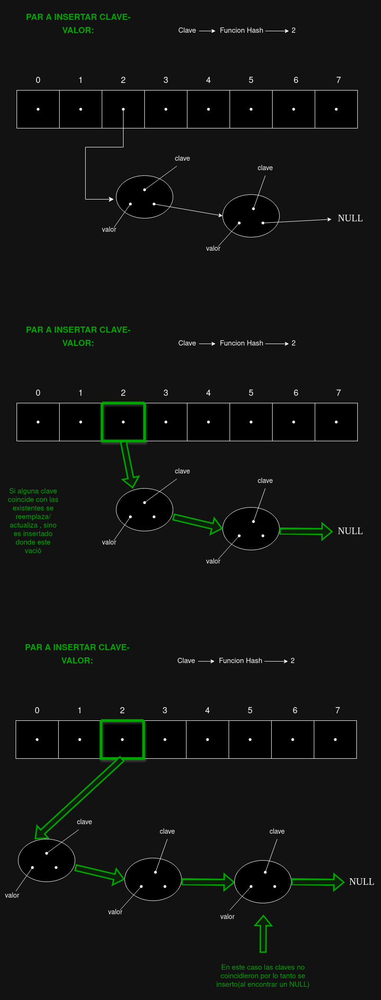
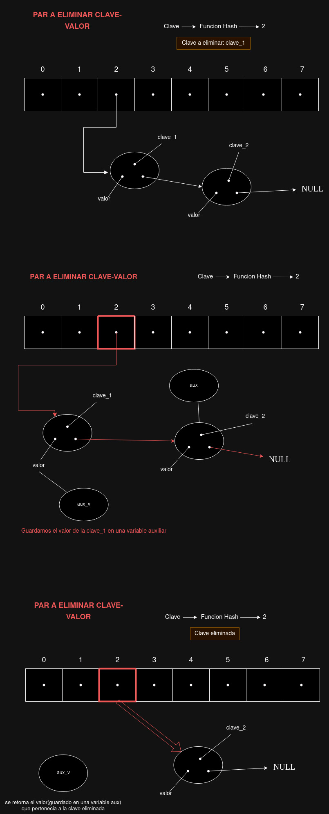
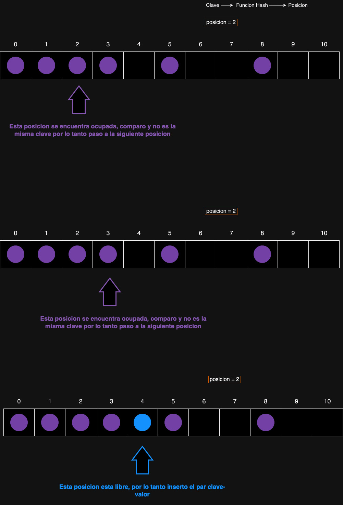
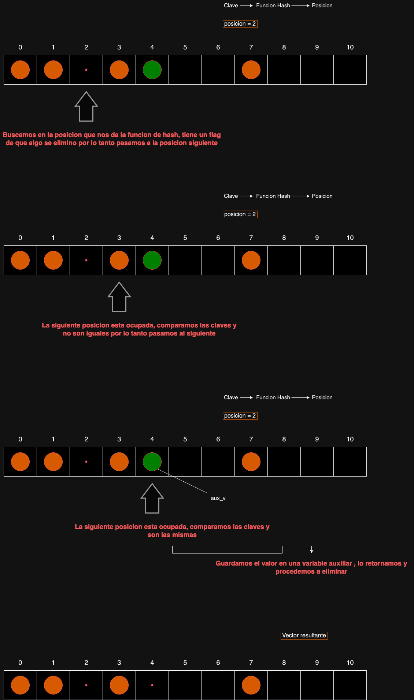

<div align="right">

</div>

# TDA HASH

## Repositorio de (Juan Bautista Oviedo Runzio) - (110164) - (jbauti9@gmail.com/joviedo@fi.uba.ar)

- Para correr todo:

```bash
make
```

- Para compilar:

```bash
gcc -std=c99 -Wall -Wconversion -Wtype-limits -pedantic -Werror -O2 -g src/*.c pruebas_alumno.c -o pruebas_alumno
```

- Para ejecutar:

```bash
./pruebas_alumno
```

- Para ejecutar con valgrind:

```bash
valgrind --leak-check=full --track-origins=yes --show-reachable=yes --error-exitcode=2 --show-leak-kinds=all --trace-children=yes ./pruebas_alumno
```

---

## Introducción

El objetivo del trabajo práctico es implementar un diccionario utilizando el TDA HASH y sus primitivas. Existen dos tipos de HASH: abierto y cerrado. El HASH abierto almacena los elementos fuera de la tabla, es decir, guarda los elementos o los punteros a los elementos en una estructura separada, y la tabla contiene el puntero a dicha estructura. Esta estructura puede tener a su vez un puntero a otra estructura que contiene otro elemento. Esto implica que la posición generada por la función HASH es definitiva para encontrar el elemento; si no se encuentra en la primera estructura, se busca en la siguiente. Esto es conocido como direccionamiento cerrado (la dirección es la que proporciona la función).

En contraste, el HASH cerrado almacena el elemento o el puntero al elemento dentro de la tabla. Dado que solo puede haber un elemento por posición, cuando se generan colisiones se busca la siguiente posición libre más cercana, haciendo que la posición dada por la función hash no sea definitiva. A esto se le conoce como direccionamiento abierto.

Para la implementación se utilizó un hash abierto con direccionamiento cerrado, donde la tabla es un vector de punteros a nodos. Cada nodo contiene un puntero a una clave (en este caso, una cadena de caracteres), un puntero a un valor (elemento) y un puntero al siguiente nodo, que puede ser null si no hay otro nodo. La estructura que contiene el vector, llamada hash, incluye además dos variables enteras: una para la cantidad de elementos almacenados y otra para la capacidad del hash.

Para confirmar la correcta implementación del TDA, se realizaron pruebas unitarias que simulan la mayor cantidad de casos posibles. Para la realización de las pruebas, se siguió un enfoque de desarrollo basado en pruebas (TDD), donde primero se escriben las pruebas y luego se implementa la mínima solución que las satisface.

---

## Funcionamiento

Para la implementación se definieron dos estructuras de datos: la estructura nodo, que contiene tres punteros (uno para el nodo siguiente, uno para la clave y el último para el valor), y la estructura del hash, que contiene dos enteros para almacenar la cantidad de pares y la capacidad, y un vector de punteros a nodos.

El recorrido de las posiciones del vector del hash se hizo de forma iterativa, ya que era simplemente recorrer un vector común. Para recorrer los nodos pertenecientes a una posición, se usaron funciones recursivas, similares a las del TDA lista. En el caso del `rehash`, se recorrieron los nodos del vector antiguo de manera iterativa con un while para simplificar, utilizando `insertar_nodo` con el nuevo vector en cada iteración.

#### Insertar:

Para la inserción, se utilizó una función auxiliar llamada `insertar_nodo`, que es recursiva. Esta función recorre los nodos pertenecientes a una posición del vector (formando una lista de nodos), se encarga de reservar memoria y verificar que la operación se haya realizado correctamente, y asigna el valor y la clave al nodo creado, así como al string creado.

```c
if (!nodo) {
		struct nodo *nuevo_nodo = malloc(sizeof(struct nodo));
		if (!nuevo_nodo)
			return NULL;
		size_t largo = strlen(clave);
		char *nueva_clave = malloc((largo + 1) * sizeof(char));
		if (!nueva_clave) {
			free(nuevo_nodo);
			return NULL;
		}
		strcpy(nueva_clave, clave);
		nuevo_nodo->clave = nueva_clave;
		nuevo_nodo->elemento = elemento;
		nuevo_nodo->siguiente = NULL;
		if (anterior)
			*anterior = NULL;
		(*tope)++;
		return nuevo_nodo;
	}
```

Para el `rehash`, se creó una función llamada `rehash`, que crea un nuevo vector de punteros a nodos con la nueva capacidad. Luego, recorre el antiguo vector de forma iterativa y, a medida que avanza, utiliza la función `insertar_nodo` en el nuevo vector. Después de insertar, libera la memoria del nodo en el antiguo vector (incluyendo la de la clave y la del nodo). Una vez terminado el recorrido del vector, este queda vacío porque se han eliminado las estructuras, por lo que solo resta liberar la memoria del antiguo vector y asignar el nuevo vector al hash. Finalmente, se actualiza la capacidad del vector y se retorna el hash actualizado.

#### Eliminar:

Para eliminar un nodo, se creó una función llamada `eliminar_nodo`, la cual es recursiva:

```c
{
	if (!nodo)
		return NULL;
	struct nodo *nodo_aux = NULL;
	if (strcmp(nodo->clave, clave) == 0) {
		*elemento_encontrado = nodo->elemento;
		nodo_aux = nodo->siguiente;
		free(nodo->clave);
		free(nodo);
		*eliminado = true;
		return nodo_aux;
	}

	nodo->siguiente = eliminar_nodo(nodo->siguiente, clave,
					elemento_encontrado, eliminado);
	return nodo;
}
```

Esta función es encargada de comparar la clave dada, con la clave del nodo actual; si son iguales, guarda en un auxiliar el nodo siguiente, libera la memoria reservada para el nodo a eliminar y retorna el siguiente nodo que estaba en el auxiliar. Si las claves no coinciden, la función sigue buscando, pero si encuentra un `NULL`, sale de la función ya que no existe el nodo con la clave buscada. En caso de eliminar satisfactoriamente, se cambia el valor de un flag pasado por referencia, lo que hace que la función `quitar` disminuya en 1 el contador de elementos del hash.

#### Destruir y Destruir Todo:

La función `destruir_todo` recorre el vector de forma iterativa. Si el destructor no es `NULL`, aplica el destructor al elemento. Luego, libera la memoria reservada para la clave y el nodo. Finalmente, libera la memoria reservada para el vector y luego para el hash. La función destruir utiliza la función `destruir_todo` con un destructor `NULL`.

---

## Respuestas a las preguntas teóricas

#### Primitivas de un HASH abierto

- Insertar: Para insertar un par clave-valor, se genera una posición usando la función hash, pasándole como parámetro la clave. La función hash devuelve la posición, y con esta buscamos en el vector, donde pueden ocurrir las siguientes situaciones: si la posición está vacía, se inserta el par clave-valor; si ya hay un par clave-valor, se verifica si la clave es la misma que la del par que queremos insertar. Si la clave es la misma, se reemplaza el valor existente con el nuevo. Si no es la misma clave, se avanza al siguiente nodo (o a la estructura correspondiente) y se repite el proceso hasta lograr insertar o actualizar.

Insertar implica los siguientes pasos: se reserva memoria para la nueva estructura que contendrá el par clave-valor. Si la reserva de memoria es exitosa, se reserva memoria para la clave. Si esta operación también es exitosa, se copia la clave y el valor o su puntero en la nueva estructura creada. En caso de fallo al reservar memoria, se libera la memoria previamente reservada (si falla la reserva de memoria para la clave, se libera la memoria del nodo) y se retorna null (o el valor que indique la convención utilizada). Finalmente, se incrementa en 1 la cantidad de elementos almacenados.

<div align="center">

</div>

- Eliminar: Se obtiene la posición utilizando la clave y la función hash, y se busca en el vector la posición correspondiente. Al igual que en la inserción, pueden ocurrir las siguientes situaciones: si la posición está vacía, no hay nada que eliminar, por lo que se devuelve el valor establecido por convención (en este caso, null); si hay un par clave-valor, se compara la clave buscada con la existente. Si son iguales, se elimina el nodo; si no son iguales, se avanza al siguiente nodo y se repiten los pasos.

Eliminar implica los siguientes pasos: se guarda en un auxiliar el puntero al siguiente nodo, y en otro auxiliar se guarda el elemento o su puntero. Luego, se elimina el nodo (liberando la memoria ocupada por la estructura que contiene la clave y valor buscados) y se retorna el auxiliar que apunta al siguiente nodo para poder conectarlo con el nodo predecesor del eliminado. Finalmente, se disminuye en 1 la cantidad de elementos almacenados.

<div align="center">

</div>

- Buscar: Se obtiene la posición utilizando la clave y la función hash, y se busca en el vector la posición correspondiente. Al igual que en la inserción y eliminación, pueden ocurrir las siguientes situaciones: si la posición está vacía, el valor buscado no existe, por lo que se devuelve el valor establecido por convención (en este caso, null); si hay un par clave-valor, se compara la clave buscada con la existente. Si son iguales, se retorna el puntero al elemento; si no son iguales, se avanza al siguiente nodo y se repiten los pasos hasta encontrar el elemento o llegar al final.

#### Primitivas de un HASH cerrado

- Insertar: Se obtiene la posición utilizando la función hash y se busca la posición en el vector. Pueden ocurrir las mismas tres situaciones, pero se procede de manera diferente debido al direccionamiento abierto: si la posición está vacía, se inserta el par clave-valor; si existe un par clave-valor, se comparan las claves. Si son iguales, se reemplaza el elemento existente con el nuevo; si son distintas, se pasa a la siguiente posición del vector y se verifica nuevamente. Este proceso se repite las veces necesarias hasta poder insertar el par clave-valor.

Insertar implica los siguientes pasos: reservar memoria para la clave, asignar la copia de la clave y el elemento a la estructura del vector. Finalmente, se incrementa en 1 la cantidad de elementos almacenados.

<div align="center">

</div>

- Eliminar: Se obtiene la posición utilizando la función hash y se busca en el vector. Se encuentran las mismas tres situaciones, pero es importante mencionar que al eliminar se deja una bandera indicando que algo fue eliminado. Al encontrar la posición, se verifica si es la clave buscada; en caso afirmativo, se elimina y se deja la bandera en true. Si no es la misma clave, se pasa a la siguiente posición, ya que pudo haber una colisión al insertarla. Este proceso se repite hasta encontrar la clave buscada o hasta encontrar una posición vacía en el vector sin la bandera de eliminado. Si se encuentra una posición vacía sin la bandera, significa que el par clave-valor estuvo en el primer lugar con la bandera encontrada o nunca se insertó, ya que en caso de colisión se hubiese buscado la siguiente posición libre. Por lo tanto, no hay posibilidad de que la clave buscada exista si se encuentra un espacio vacío.

 <div align="center">

</div>

- Buscar: El proceso de búsqueda es similar al de eliminación, pero sin "eliminar". Si se encuentra la clave buscada, se retorna el valor; si no, se continúa buscando en las siguientes posiciones hasta encontrarla o encontrar un espacio vacío sin la bandera de eliminado.

Para ambos casos, HASH abierto o cerrado, se debe realizar el rehash, que implica agrandar la tabla o vector. Para esto, se establece un porcentaje de ocupación de la tabla que determina cuándo realizarlo. Antes de insertar un elemento (preferiblemente), se verifica si sumando 1 a la cantidad de pares guardados se sobrepasa el porcentaje establecido. De ser así, se realiza el rehash y luego se inserta; de lo contrario, solo se inserta. El rehash puede hacerse de varias maneras: se puede agrandar solo la tabla o crear un hash nuevo. De cualquier forma, se debe recorrer la tabla anterior y almacenar los pares en la nueva tabla, utilizando la función hash y la capacidad de la nueva tabla. Esto es necesario porque al cambiar la capacidad, la posición generada por la función hash también puede cambiar.

#### Función de hash:

Una función de hash es un algoritmo que toma una entrada (o "clave") y devuelve un valor numérico de longitud fija, llamado "hash". Este valor numérico se utiliza como un índice para almacenar elementos en una estructura de datos llamada "tabla hash". La función de hash tiene como objetivo distribuir las claves de manera uniforme a través de la tabla para minimizar las colisiones.

Características que debe tener una función de hash:

- Para una misma entrada, la función debe siempre producir el mismo hash.
- Debe ser eficiente, la función debe ser capaz de calcular el hash rápidamente, incluso para entradas de gran tamaño.
- Debe distribuir las claves de manera uniforme a lo largo del espacio de hash, evitando agrupamientos para minimizar colisiones.
- Poca sensibilidad a entradas similares, dos entradas similares deben producir valores de hash significativamente diferentes para reducir colisiones.
- Bien distribuida ,cada posición en la tabla debe ser igualmente probable de ser seleccionada por la función de hash.

#### Tabla de Hash:

Una tabla de hash es una estructura de datos que permite la asociación rápida de claves con valores. Utiliza una función de hash para mapear las claves a posiciones (índices) en una tabla, donde se almacenan los pares clave-valor. La principal ventaja de una tabla de hash es que puede proporcionar un acceso muy rápido a los datos, típicamente O(1) en promedio.

Métodos de resolución de colisiones:
Las colisiones ocurren cuando la función de hash asigna dos o más claves a la misma posición en la tabla. Para manejar esto, se utilizan varios métodos de resolución de colisiones:

Encadenamiento (Chaining):
Cada posición en la tabla contiene un puntero a una lista enlazada (o cualquier otra estructura de datos) que almacena todos los pares clave-valor que comparten la misma posición de hash.
La ventaja es que es fácil de implementar y manejar.
La desventaja, puede degradar el rendimiento si muchas claves colisionan, convirtiendo las operaciones en O(n).

Probing Lineal (Linear Probing):
En caso de colisión, se busca secuencialmente la siguiente posición libre en la tabla.
La ventaja, simple de implementar y no requiere estructuras adicionales.
La desventaja puede causar "clustering", donde grupos de claves colisionan y llenan secuencias contiguas de la tabla.

Probing Cuadrático (Quadratic Probing):
Similar al probing lineal, pero en lugar de buscar secuencialmente, se usa una función cuadrática para determinar la siguiente posición.
La ventaja es que reduce el problema de clustering primario comparado con el probing lineal.
La desventaja es que puede aún provocar clustering secundario y puede ser complicado encontrar una posición libre si la tabla está bastante llena.

Double Hashing:
Usa dos funciones de hash diferentes. Si una clave colisiona, la segunda función de hash se utiliza para encontrar la siguiente posición libre.
La ventaja es que minimiza el clustering y distribuye las colisiones más uniformemente.
La desventaja, es más compleja de implementar y requiere que ambas funciones de hash sean eficientes y bien distribuidas.

Estos métodos aseguran que incluso si dos claves producen el mismo hash, aún se puede almacenar y acceder a cada clave-valor de manera eficiente.
